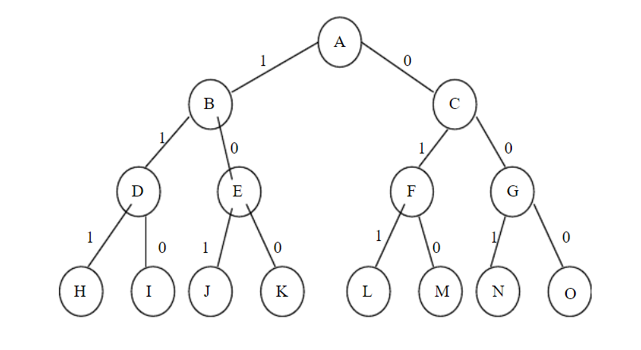

## 一、填空题

1. 一个算法就是一个有穷规则的集合，其中之规则规定了解决某一特殊类型问题的一系列运算，此外，算法还应具有以下五个重要特性:`_________,________,________,__________,__________。`

答案：`确定性 有穷性 可行性 输入 输出`

2. 算法的复杂性有________和___________之分，衡量一个算法好坏的标准是__________。

答案：`时间复杂性 空间复杂性 时间复杂度高低`

3. 某一问题可用动态规划算法求解的显著特征是___________。

答案：`该问题具有最优子结构性质`

4. 若序列X={B,C,A,D,B,C,D}，Y={A,C,B,A,B,D,C,D}，请给出序列X和Y的一个最长
公共子序列____________。

答案：`{BABCD}或{CABCD}或{CADCD｝`

5. 用回溯法解问题时，应明确定义问题的解空间，问题的解空间至少应包含___________。

答案：`一个（最优）解`

6. 动态规划算法的基本思想是将待求解问题分解成若干____________，先求解___________，然后从这些____________
的解得到原问题的解。

答案：`子问题 子问题 子问题`

7. 以深度优先方式系统搜索问题解的算法称为_____________。

答案：`回溯法`

8. 0-1背包问题的回溯算法所需的计算时间为_____________,用动态规划算法所需的计算时间为____________。

答案：`o(n*2n) o(min{nc,2n})`

9. 动态规划算法的两个基本要素是_________ 和 ___________。

答案：`最优子结构 重叠子问题`

10. 二分搜索算法是利用_______________实现的算法。

答案：`动态规划法`

## 二、综合题
 
1. 写出设计动态规划算法的主要步骤。

`①问题具有最优子结构性质；`
`②构造最优值的递归关系表达式；`
`③最优值的算法描述；`
`④构造最优解`

2. 若n=4，在机器M1和M2上加工作业i所需的时间分别为ai和bi，且(a1,a2,a3,a4)=(4,5,12,10)，(b1,b2,b3,b4)=(8,2,15,9)求4个作业的最优调度方案，并计算最优值。

`步骤为：N1={1，3}，N2={2，4}； N1’={1，3}， N2’={4，2}； 最优值为：38`

3. 使用回溯法解0/1背包问题：n=3，C=9，V={6,10,3}，W={3,4,4},其解空间有长度为3的0-1向量组成，要求用一棵完全二叉树表示其解空间（从根出发，左1右0），并画出其解空间树，计算其最优值及最优解。

`解空间为{(0,0,0),(0,1,0),(0,0,1),(1,0,0),(0,1,1),(1,0,1), (1,1,0),(1,1,1)}。`

4. 描述0-1背包问题。

`已知一个背包的容量为C，有n件物品，物品i的重量为Wi，价值为Vi，求应如何选择装入背包中的物品，使得装入背包中物品的总价值最大`

## 一、填空题

1、 算法就是一组有穷的____，它们规定了解决某一特定类型问题的____。 

`规则 一系列运算`

2、 在进行问题的计算复杂性分析之前，首先必须建立求解问题所用的计算模型。3个基 本计算模型是____ 、____ 、 ____。 

`随机存取机RAM(Random Access Machine)；`

`随机存取存储程序机RASP(Random Access Stored Program Machine)；`

`图灵机(Turing Machine)`

3、 算法的复杂性是____的度量，是评价算法优劣的重要依据。 

`算法效率`

4、 计算机的资源最重要的是____和____资源。因而，算法的复杂性有____和____之分。

`时间 、空间、时间复杂度、 空间复杂度 `

5、 f(n)= 6×2n +n2 ，f(n)的渐进性态f(n)= O(____) 

`2n`

6、 贪心算法总是做出在当前看来____的选择。也就是说贪心算法并不从整体最优考 虑，它所做出的选择只是在某种意义上的____。 

`最好 局部最优选择`

7、 许多可以用贪心算法求解的问题一般具有2个重要的性质：____性质和____性质。 

`贪心选择 最优子结构`

## 二、简答题

1、 简单描述分治法的基本思想。 

`分治法的基本思想是将一个规模为n的问题分解为k个规模较小的子问题，这些子问 题互相独立且与原问题相同；对这k个子问题分别求解。如果子问题的规模仍然不够小，则再划分为k个子问题，如此递归的进行下去，直到问题规模足够小，很容易求出其解为止；将求出的小规模的问题的解合并为一个更大规模的问题的解，自底向上逐步求出原来问题的解。 `

2、 简述动态规划方法所运用的最优化原理。 

`“最优化原理”用数学化的语言来描述：假设为了解决某一优化问题，需要依次作出n 个决策D1，D2，…，Dn，如若这个决策序列是最优的，对于任何一个整数k，1 < k < n，不论前面k个决策是怎样的，以后的最优决策只取决于由前面决策所确定的当前状态，即以后的决策Dk+1，Dk+2，…，Dn也是最优的。 `

3、 何谓最优子结构性质？ 

`某个问题的最优解包含着其子问题的最优解。这种性质称为最优子结构性质。`

4、 简单描述回溯法基本思想。 

`回溯法的基本思想是在一棵含有问题全部可能解的状态空间树上进行深度优先搜索， 解为叶子结点。搜索过程中，每到达一个结点时，则判断该结点为根的子树是否含有问题的解，如果可以确定该子树中不含有问题的解，则放弃对该子树的搜索，退回到上层父结点，继续下一步深度优先搜索过程。在回溯法中，并不是先构造出整棵状态空间树，再进行搜索，而是在搜索过程，逐步构造出状态空间树，即边搜索，边构造。 `

5、 何谓P、NP、NPC问题

`P(Polynomial问题)：也即是多项式复杂程度的问题。NP就是Non-deterministic Polynomial的问题，也即是多项式复杂程度的非确定性问题。 NPC(NP Complete)问题，这种问题只有把解域里面的所有可能都穷举了之后才能得出答案，这样的问题是NP里面最难的问题，这种问题就是NPC问题。`