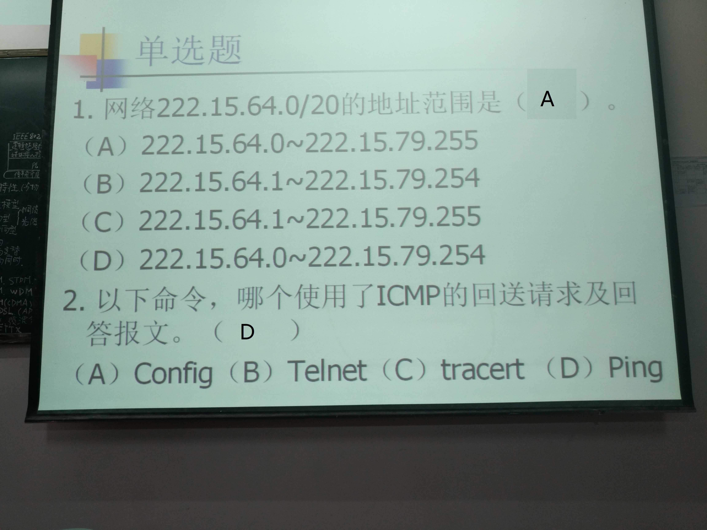
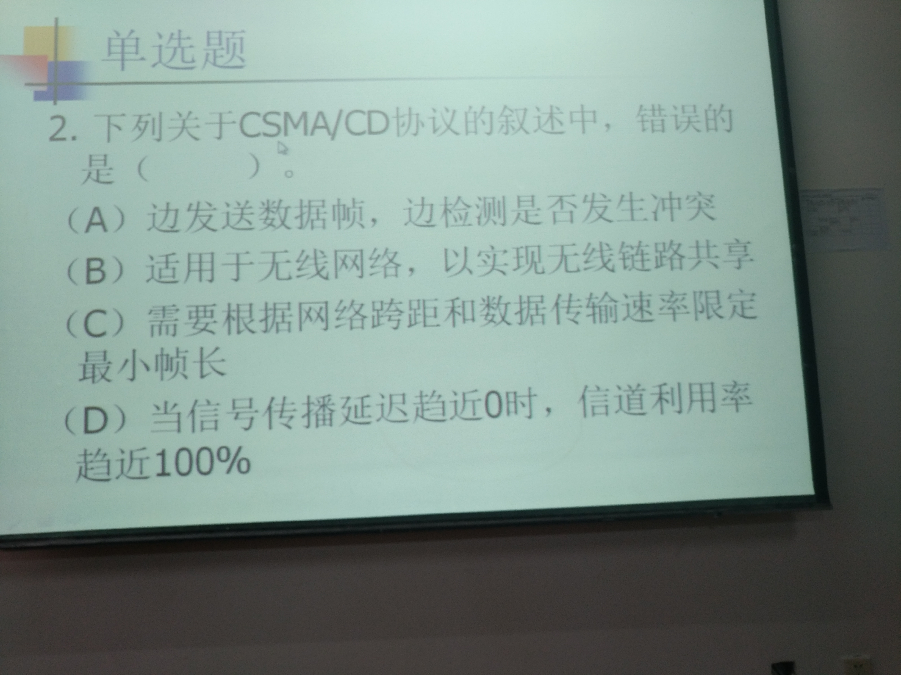

# 计算机网络随堂练习题

Author [`@CasterWx`](https://github.com/CasterWx)

Contact `antzuhl1998@gmail.com` `1325200471@qq.com`

* 

```
3. 答案(C)
```

* 
       
```
4. 
5. 
```

* 

```
3. 
```

* 

* 

* 

* 

* 

* 

* 

* 

* 

* 

* 

* 

* 

* 

* 

* 

* 

* 

* 

* 