# 计算机网络复习要点

Author [`@CasterWx`](https://github.com/CasterWx)

Contact `antzuhl1998@gmail.com` `1325200471@qq.com`

### [目录]

* #### [考点](#ch00)
* #### [第一章 概述](#ch01)
* #### [第二章 物理层](#ch02)
* #### [第三章 数据链路层](#ch03)
* #### [第四章 网络层](#ch04)
* #### [第五章 运输层](#ch05)
* #### [第六章 应用层](#ch06)

## <span id="ch00">考点</span>

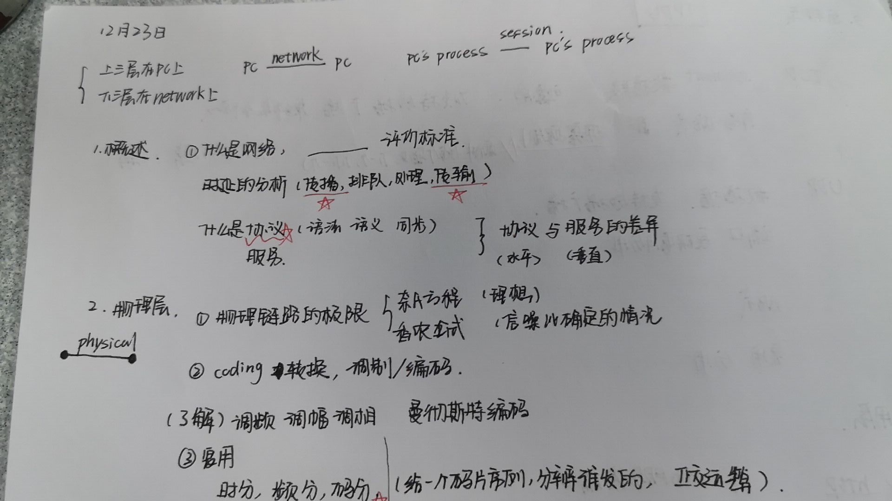
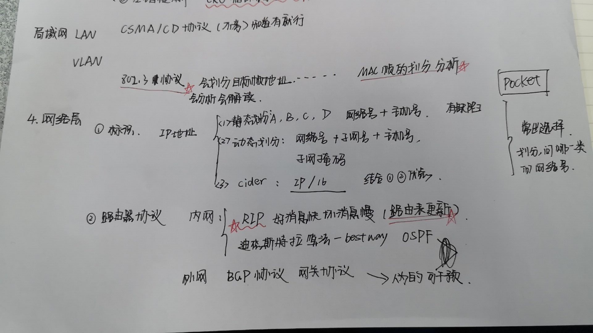
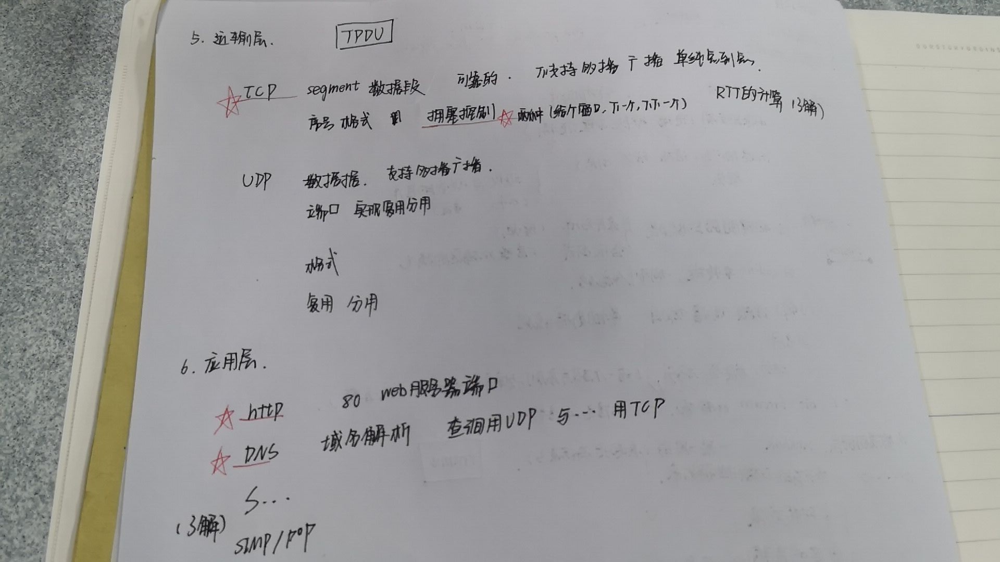

## <span id="ch01">第一章 概述</span>

1.计算机网络的两个重要基本特点：`连通性`和`共享`。

2.计算机网络由`若干结点`和`连接这些结点的链路`组成。

3.网络指把主机连接在一起。`internet 是互连网`，是网络的网络，通过路由器把许多网络连接在一起。`Internet是互联网`，指全球最大的、开放的、由众多网络相互连接而成的特定互连网，采用 TCP/IP协议簇作为通信的规则。

4.计算机网络的五层模型


* 应用层 通过应用进程间的交互来完成特定网络应用。

* 运输层 负责向两台主机进程之间的通信提供通用的数据传输服务。

* 网络层 负责为分组交换网上的不同主机提供通信服务。

* 数据链路层 两台主机之间的数据传输，总是在一段一段的链路上传送的，这就需要使用专门的链路层的协议。

* 物理层 实现相邻计算机节点之间`比特流的透明传送`，尽可能`屏蔽`掉具体传输介质和物理设备的差异。

1. 互联网标准化工作的三个阶段：① 互联网草案；② 建议标准；③ 互联网标准。

2. 互联网的边缘部分：由所有连接在互联网上的主机组成。用于通信和资源共享，用户直接使用。

3. 互联网的核心部分：由大量网络和连接这些网络的路由器组成。是为边缘部分提供服务的。

4. 边缘部分的两种通信方式：客户-服务器方式（C/S 方式）和对等方式（P2P 方式）。

5. 核心部分的三种交换方式区别与联系：

* 电路交换：电路交换是面向连接的，有专属的物理通路，建立连接、通信、释放连接。

* 分组交换：单个分组传送到相邻结点，存储下来后查找转发表，转发到下一个结点。

* 报文交换：整个报文传送到相邻结点，全部存储下来后查找转发表，转发到下一个结点。

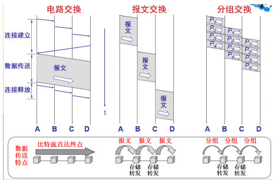

优缺点：

* 电路交换：端对端通信质量因约定了通信资源获得可靠保障，对连续传送大量数据
效率高。

* 报文交换：无须预约传输带宽，动态逐段利用传输带宽对突发式数据通信效率高，通
信迅速。

* 分组交换：具有报文交换之高效、迅速的要点，且各分组小，路由灵活，网络生存性
能好。

10. 计算机网络分类： 注意英文简写

* 按照作用范围：① 广域网 WAN；② 城域网 MAN；③ 局域网 LAN；④个人区域网 PAN。

* 按照使用者：① 公用网；② 专用网

用来把用户接入到互联网的网络：接入网 AN。

11. 计算机网络性能指标：

* 速率：指数据的传送速率，单位：bit/s。
* 带宽：指单位时间内某信道能通过的“最高速率”，单位：bit/s。
* 吞吐量：是单位时间内某网络的实际的数据量。
* 时延：
  * `发送时延`：主机或路由器发送数据帧所需要的时间，=帧长度/发送速率。
  

  * `传播时延`：电磁波在信道种传播移动距离花费的时间，=信道长度/传播速率。
  
    ```
        1.比特的传播时延与链路宽度的关系是()
            A.没有关系  B.反比关系
            C.正比关系  D.无法确定
        答案 : A 。传播时延=信道长度/传播速率，而链路宽度只能衡量发送时延。
    ```

  * 处理时延：主机或路由器收到分组处理所花费的时间。
  * 排队时延：分组在路由器的输入队列种排队所产生的时延。
* 时延带宽积：=传播时延×带宽。又称为以比特为单位的链路长度。
* 往返时间 RTT：双向交互一次所需的时间。
* 利用率：信道或网络的利用率过高会产生非常大的时延。

12. 计算机网络体系结构

* 法律上的国际标准 OSI（开放系统互连基本参考模型）
* 事实上的国际标准 TCP/IP。

13. `网络协议三要素`

* 语法：数据与控制信息的结构或格式。
* 语义：需要发出何种控制信息，完成何种动作及做出何种响应。
* 同步：事件实现顺序的详细说明。

14. 实体、`协议`、`服务`：

* 实体：表示任何发送或接收信息的硬件或软件进程。

* 协议：控制两个或多个对等实体进行通信的规则的集合。

* 服务：下层向上层提供的服务。协议是“水平的”，即协议控制的是对等实体间的通信。服务是“垂直的”，即服务是下层向上层通过层间接口提供的。

## <span id="ch02">第二章 物理层</span>

1. 物理链路的极限

* 奈奎斯特定理

* 香农公式


```
1. 电话系统的信道宽度是3000Hz，信噪比是30dB，则该系统的最大数据传输率是____。

答案 : 30kbit/s 。
信噪比是30dB， 10log10^(1+S/N)=30 ， S/N = 1000.
最大传输率=3000log2^(1+S/N)=30kbit/s 。
```

2. 常用编码方式 (了解)

* 不归零制：正电平代表 1，负电平代表 0。

* 归零制：正脉冲代表 1，负脉冲代表 0。

* 曼彻斯特编码：位周期中心的向上跳变代表 0，位周期中心的向下跳变代表 1。但也可反过来定义。

* 差分曼彻斯特编码：在每一位的中心处始终都有跳变。位开始边界有跳变代表 0，而位开始边界没有跳变代表 1。

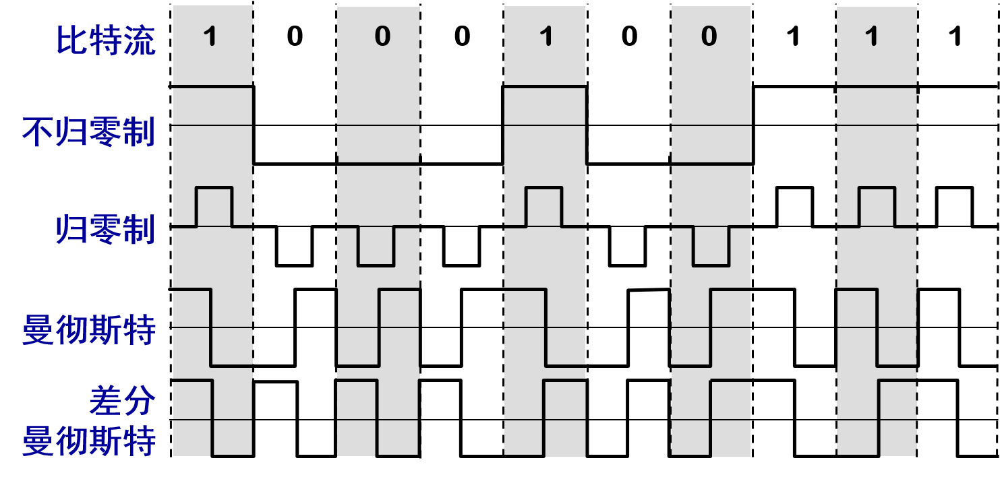

3. 信道复用技术

* 时分复用

* 频分复用

* 码分复用 `重点`

    * 每一个比特时间划分为 m 个短的间隔，称为码片 (chip)。

    * 每个站被指派一个唯一的 m bit 码片序列。

    * 如发送比特 1，则发送自己的 m bit 码片序列。

    * 如发送比特 0，则发送该码片序列的二进制反码。
    ```
    例如，S 站的 8 bit 码片序列是 00011011。
    发送比特 1 时，就发送序列 00011011，
    发送比特 0 时，就发送序列 11100100。
    S 站的码片序列：(–1 –1 –1 +1 +1 –1 +1 +1)  
    ```

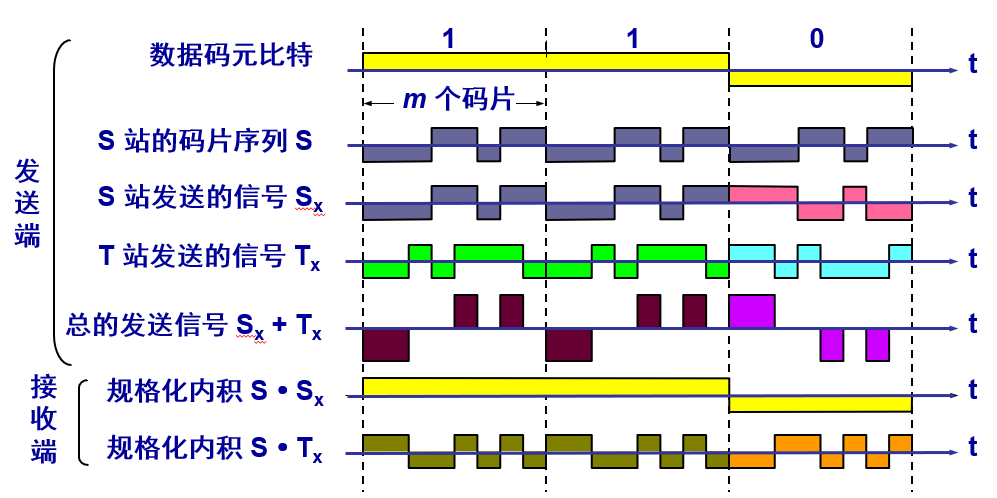

## <span id="ch03">第三章 数据链路层</span>

## <span id="ch04">第四章 网络层</span>

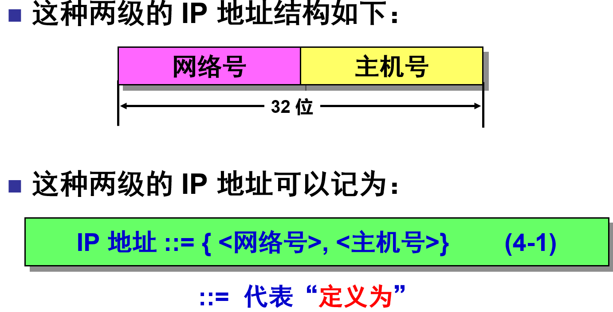
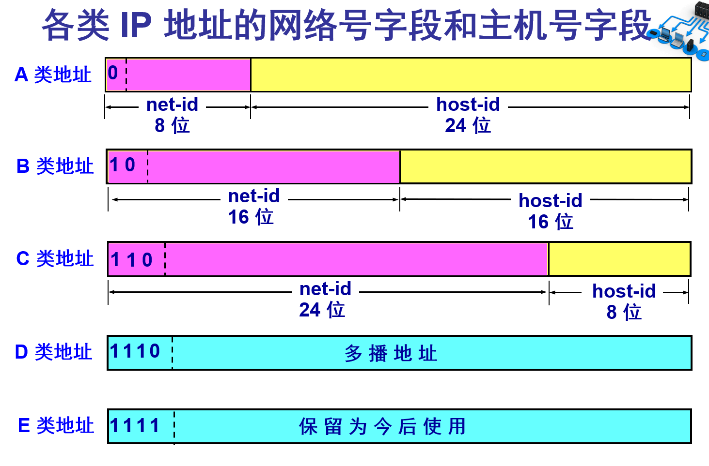
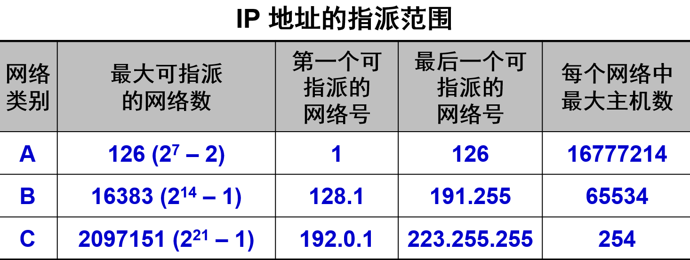
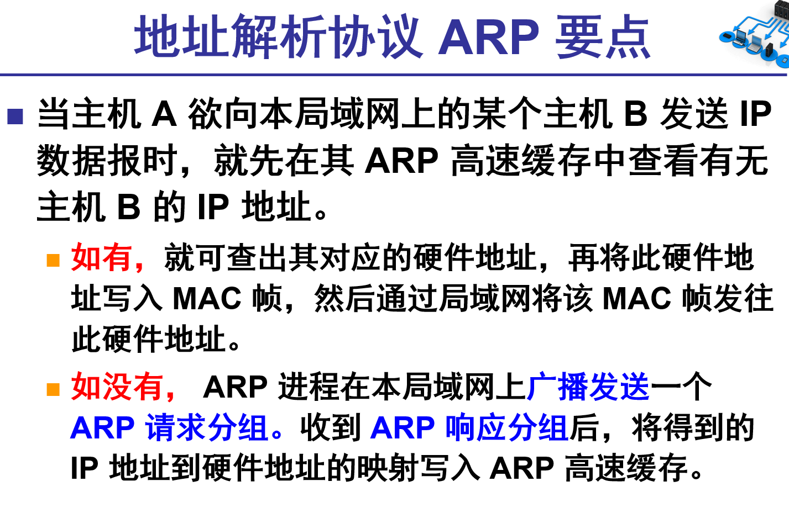
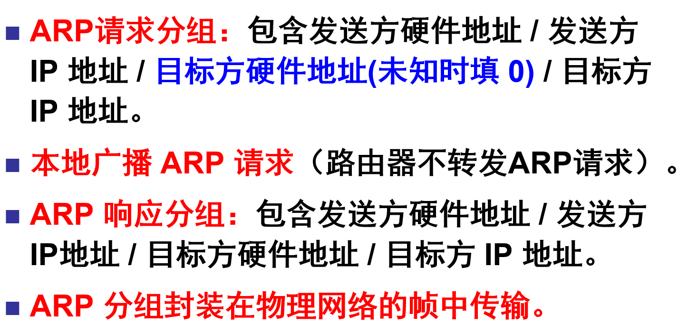

## <span id="ch05">第五章 运输层</span>

## <span id="ch06">第六章 应用层</span>