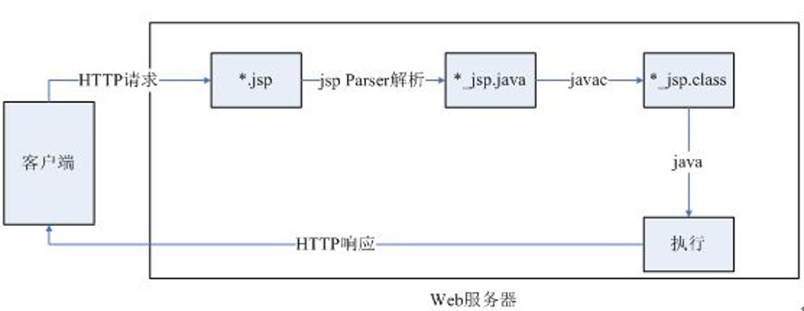

# Java Web 复习要点

[`@CasterWx`](https://github.com/CasterWx)

## 目录
* [第一章 JavaWeb开发快速入门](#ch01)
* [第二章 Web前端技术](#ch02)
* [第三章 JSP语法基础](#ch03)
* [第四章 JDBC技术](#ch04)

## <span id="ch01">第一章 JavaWeb开发快速入门</span>

### 1.常见Web开发技术

```
表现层：前端开发技术，例如HTML 、CSS 、JavaScript 、DOM(Document Object Model) 、ActiveX、VBScript、Applet、JSP、jQuery等
控制层：Servlet 、Struts的Action等技术。
业务逻辑层：JavaBean和EJB((Enterprise JavaBean)等技术 
持久层：JDBC、Hibernate、MyBatis
```

### 2.容器的作用（Tomcat是什么）

```
Web服务器是，只有将开发的Web项目放置到该容器运行及发布Web应用的容器中，才能使网络中的所有用户通过浏览器进行访问。安装Web容器的计算机称为Web服务器。
Tomcat是一个JSP/Servlet容器。
```

### 3.Tomcat默认端口是8080，MySQL默认端口是3306。

### 4.web应用的发布目录 : `webapps`

### 5.web应用第三方库文件存访目录 : `WEB-INF下lib`

### 6.JSP运行机制

当客户端浏览器向服务器发出请求访问一个JSP页面时，服务器根据该请求加载相应的JSP页面，并对该页面进行编译，然后执行。

* 当一个JSP页面第一次被请求时，容器首先会把JSP页面转换成Servlet。在转换时，所有HTML标签将被包含在println()语句中，所有JSP元素将会被转换成Java代码。
    
* 在转换的过程中，若JSP页面存在语法错误，转换会被终止，并向服务器和客户端输出错误信息。如果转换成功，转换后的Servlet会被编译成相应的class文件。 <font color="red">JSP的本质就是Servlet。</font>
    
* 在调用Servlet时，首先执行<font color="red">_jspInit()</font>方法，然后调用<font color="red">_jspService ()</font>方法处理客户端的请求。对客户端发送的每一个请求，JSP容器都会创建一个新的线程来处理。如果有多个客户端同时请求该JSP文件，JSP容器会为每个客户端请求创建对应一个线程。

* 如果JSP文件被修改，服务器将根据设置决定是否对该文件进行重新编译。如果重新编译，内存中的Servlet会被新的编译结果取代。

* Servlet被处理完毕以后，调用_jspDestroy()方法结束它的生命周期，同时被JVM（Java虚拟机）的垃圾回收器回收。




## <span id="ch02">第二章 Web前端技术</span>

### 1.Html中标签的作用 `[理解即可:填空可能会考]`
```
标题标签<hn>
段落标签<p>
段内换行标签<br>
水平线段标签<hr>
原样显示文字标签<pre> 
特殊文字样式标签
   * b标记设置文字为粗体 
   * i标记为斜体
   * sub标记和sup标记使文字成为下标或上标 
表格：
    <table>：定义表格；
    <tr>：定义表格中的行；
    <td>：定义表格中某行中的单元格；
    <th>：定义表格中的表头单元格；
    <thead>：定义表格中的表头内容；
    <tfoot>：定义表格中的表注内容；
    <tbody>：定义表格中的主体内容。
表单<form>
输入域标签<input>
下拉列表框<select>
下拉列表框中的选项<option>
多行文本框<textarea>
```

### 2.Css的作用 `[理解即可]`

* CSS是层叠样式表的简称，是一系列格式设置规则，它们控制Web页面内容的外观。使用CSS可以非常灵活并更好地控制具体的页面外观，从精确的布局定位到特定的字体和样式。

### 3.Javascript的作用

* JavaScript是一种基于浏览器运行的脚本语言，无须编译即可在浏览器中直接运行。JavaScript主要用于浏览器端的人机交互。JavaScript可以直接嵌入到网页中，也可以单独创建一个扩展名为“.js”文本文件编写JavaScript函数。JavaScript代码基于JavaScript的事件响应执行，即当一个JavaScript的函数响应动作发生时，浏览器就开始执行相应的JavaScript代码。


## <span id="ch03">第三章 JSP语法基础</span>

### 1.JSP注释的语法格式
```
<%-- 此处为注释 --%>
```

### 2.JSP声明 `选择题可能会问[下面哪一种是正确的jsp声明?]`

* 使用标记符 ：`<%!  %>`

```java

1.声明变量
<%!
    int i = 1 ;
    CloseableHttpClient hc =  HttpClients.createDefault() ;
%>
2.声明方法
<%!  
    int add(int a,int b){
        return a+b ;
    }
%>
```

### 3.JSP中的Java表达式

* 使用标记符 ：`<%=  %>` 后面不用加`分号;`

### 4.JSP中的Java程序段

* 使用标记符 ：`<%  %>`

### 5.JSP指令

* page指令的作用 : `设置JSP页面的属性`
  * language : jsp脚本语言名称，目前只支持Java
  * pageEncoding : jsp字符编码，默认ios-8859-1
  * import : 导入所需的Java Api
* include指令的作用 : `页面包含指令`

### 6.JSP动作 `六个标记的作用`

```
<jsp:include>、<jsp:forward>、<jsp:param>
<jsp:useBean>、<jsp:setProperty>、<jsp:getProperty>
```
`后三个是和JavaBean相关的`

* `<jsp:include>` 将一个指定的页面包含到使用此动作标记的JSP页面中

* `<jsp:param>` 用来传递参数不能单独使用，一般嵌套在`<jsp:include>`、`<jsp:forward>`等动作标记内，用于向这些动作标记传递参数。
```
<jsp:param name="参数名称" value="参数值" />
```

* `<jsp:forward>` 页面重定向，即跳转至page属性指定的页面

* `<jsp:useBean>` 

* `<jsp:getProperty>` 获取JavaBean中指定属性的值

* `<jsp:setProperty>` 设置JavaBean属性的值

### 7.九个内置对象及其作用 `要会背，名字与作用`
* request：表示HTTP协议的请求，提供对请求数据的访问，JSP页面可在请求范围内共享数据。
* response：表示HTTP协议的响应，提供了访问响应报文的相关方法。
* page：代表JSP页面对应的Servlet实例。
* pageContext：表示JSP页面本身的上下文，它提供了一组方法用于管理具有不同作用域的属性。
* session：表示HTTP协议的会话，可以共享服务器与浏览器之间会话数据，一旦关闭了浏览器，会话数据将自动消毁。
* application：代表应用程序上下文，允许JSP页面与同一应用程序中的Web组件共享数据。
* out：提供对输出流的访问。
* config：提供了一组方法可访问Web应用程序的配置文件web.xml。
* exception：表示异常对象，该对象含有特定JSP异常处理页面访问的异常信息。

### 8.request对象中的方法 `程序填空`

* getAttribute() 获得名称为name的属性值，若不存在则返回null
* setAttribute(String name,Object obj) 设置一个名称为name的参数，并且其值为obj
* getCharacterEncoding() 返回request请求体的字符编码
* getParameter(String name) 获得指定参数name的参数值

### 9.response

* void sendRedirect(String path) 重定向客户的请求到指定页面

### 10.session

* getAttribute() 
* setAttribute(String name,Object obj)

### 11.application

### 12.web.xml的作用 : 配置属性信息

`考试会考servlet在web.xml中怎么配置？`
```
<servlet>
    <servlet-name>myslt</servlet-name>
    <url-pattern>/myslt</url-pattern>
</servlet>
<servlet-mapping>
    <servlet-name>myslt</servlet-name>
    <servlet-class>该servlet具体的实现类</servlet-class>
</servlet-mapping>
```

## <span id="ch04">第四章 JDBC技术</span>

### 1. JDBC访问数据库的五个步骤
```
（1）加载JDBC驱动程序
    Class.forName("com.mysql.jdbc.Driver");
（2）建立数据库连接；
    Connection con = DriverManager.getConnection("jdbc:mysql://localhost:3306/userdb", root, passwd);

（3）创建操作数据库SQL的Statement/PreparedStatement对象；
Statement statement = connection. createStatement ();

PreparedStatement ps=con.prepareStatement("insert into wy_table values (?,?)");
ps.setInt(1,6);
ps.setInt(2,"demo");

（4）执行语句并分析执行结果；
    execute(String sql) 执行指定的SQL语句。如果SQL语句返回结果，此方法返回true，否则返回false
    executeQuery(String sql) 执行查询类型(select)的SQL语句，此方法返回查询所获取的结果集ResultSet对象
    executeUpdate(String sql) 执行SQL语句中DML类型(insert、update、delete)的SQL语句，返回更新所影响的行数；执行数据定义的SQL语句，用于创建和修改临时表，没有返回值

（5）释放资源。
```

### 2. 操作数据库SQL的对象 `代码填空会考`

* Statement

* PreparedStatement

两者的区别:Statement执行静态SQL语句,PreparedStatement执行动态SQL语句
